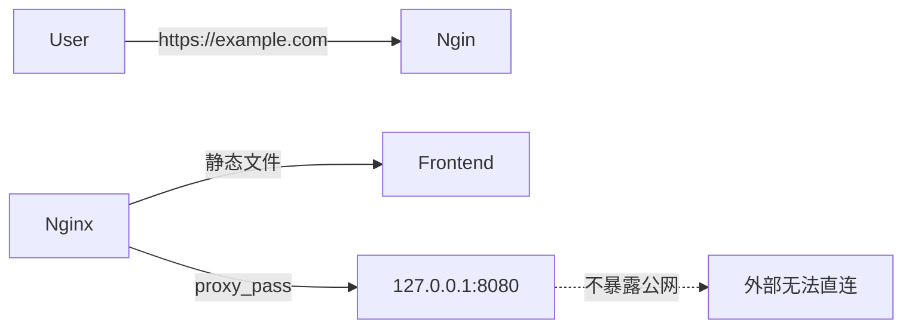

### ✅ 最终建议（生产环境标准架构）

```mermaid
graph LR
  User -->|https://example.com| Ngin
  Nginx -->|静态文件| Frontend
  Nginx -->|proxy_pass| Backend[127.0.0.1:8080]
  Backend -.->|不暴露公网| External[外部无法直连]
```

- 前端和 API 同源（`example.com`）
- 无 CORS 问题
- 后端仅本地可访问
- 安全 + 简洁 + 可维护